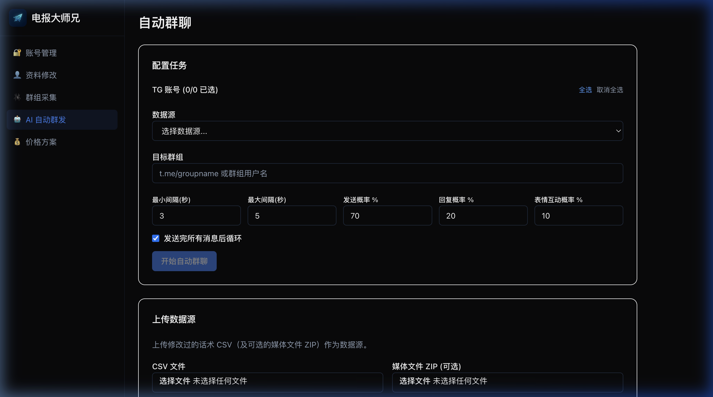

# 🤖 AI 自动群发

这是电报大师兄的核心交互引擎，利用 AI 模拟真实用户在群组中进行互动和推流。

### 配置指南

1.  **话术准备**: 上传之前扒取回来的 CSV 文件作为语料库。
2.  **模型参数**: 
    *   您可以设置 AI 的“聪明程度”和回复逻辑。
    *   配置发送频率（建议设置一定的随机范围，避免被系统判定为脚本）。
3.  **互动策略**: 
    *   设置回复比例及表情包互动百分比。
    *   开启多号轮调，让任务在多个 Session 之间自动匀速切换。

### 🚩 重要安全提示
*   请务必合理设置发送间隔，过频的互动会导致 Telegram 账号被临时限制。
*   建议开启多号轮播功能，每个账号每日发送量控制在安全范围内。
