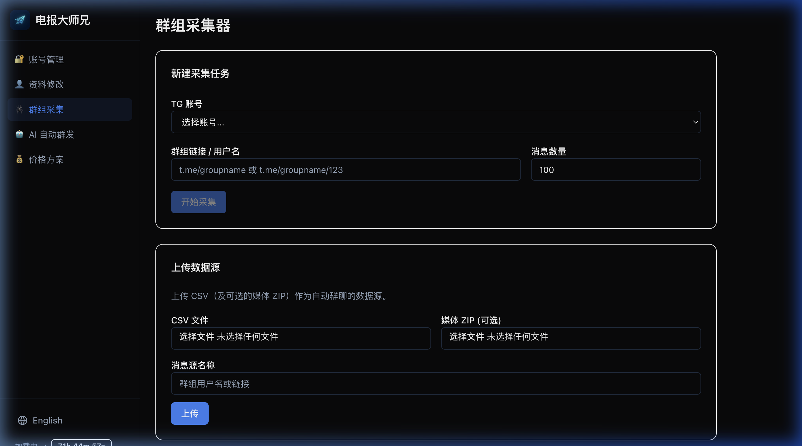

# 🔍 扒取消息 (群组采集)

精准的社群数据是营销成功的关键。大师兄的“扒取”功能支持深度挖掘公开群组的信息。

### 采集流程

1.  **输入目标**: 输入您想要扒取的群组 ID 或链接。
2.  **选择模式**:
    *   **普通模式**: 采集所有历史消息。
    *   **话题(Topic)模式**: 自动识别并扒取论坛化群组中的特定话题。
3.  **结果导出**:
    *   **CSV 数据**: 包含发送者 ID、时间、内容、引用的完整清单。
    *   **媒体文件**: 自动打包采集过程中涉及的所有图片和视频。

### 数据用途
采集回来的 CSV 文件可以直接用于 **AI 自动群发** 功能，作为 AI 学习的话术素材库。
