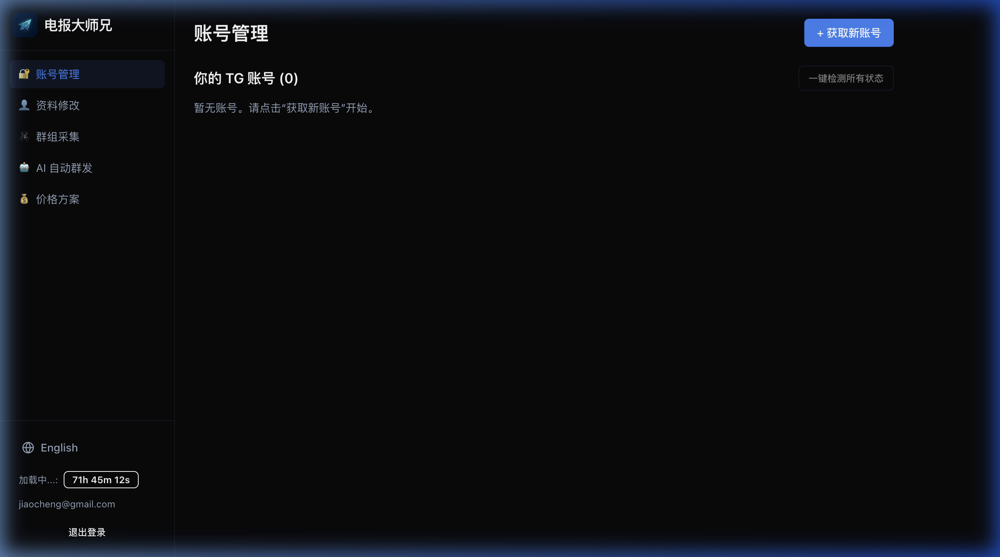

# 📱 账号管理 (Session 生成)

在电报大师兄中，账号被称为 **Session**。生成 Session 是使用所有功能的前提。

### 操作步骤

1.  **进入页面**: 在侧边栏导航中选择 **“账号管理”**。
2.  **点击生成**: 点击页面顶部的 **"+ 生成Session"** 按钮。
3.  **身份验证**:
    *   输入您的手机号（格式：`+国家代码 手机号`，如 `+86 138...`）。
    *   在 Telegram 官方 App 中查收验证码。
    *   将验证码填入大师兄的弹出框中。
4.  **保存成功**: 验证通过后，该账号将永久保存在您的列表中，除非您手动删除。

### 状态说明
*   ✅ **正常**: 账号连接正常，可以执行任务。
*   ❌ **失效**: 可能由于手机端退出或二次验证问题导致，请尝试重新生成。
